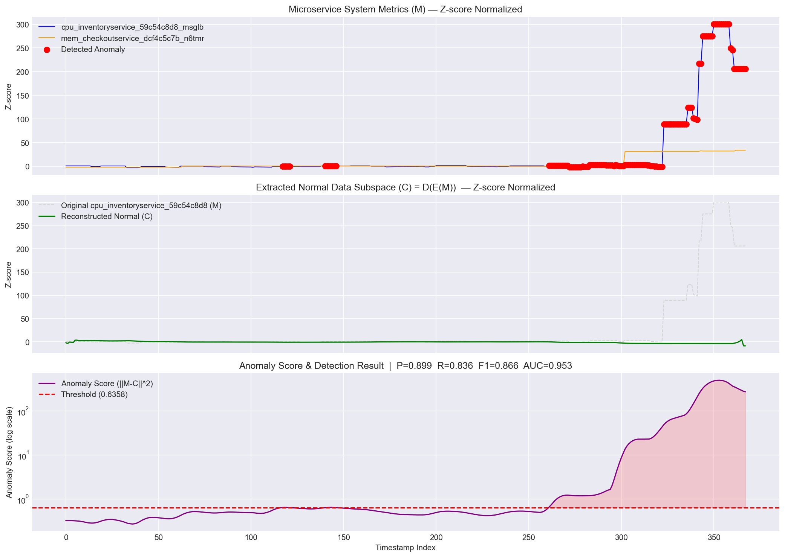
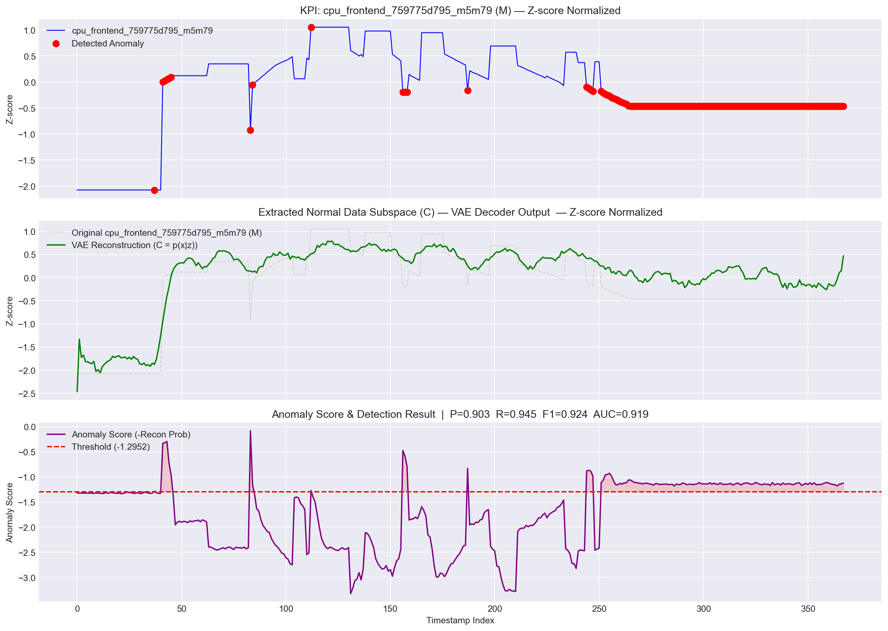
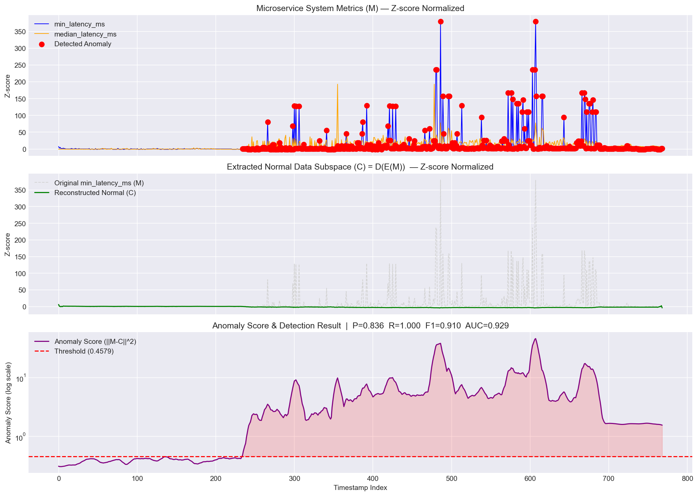
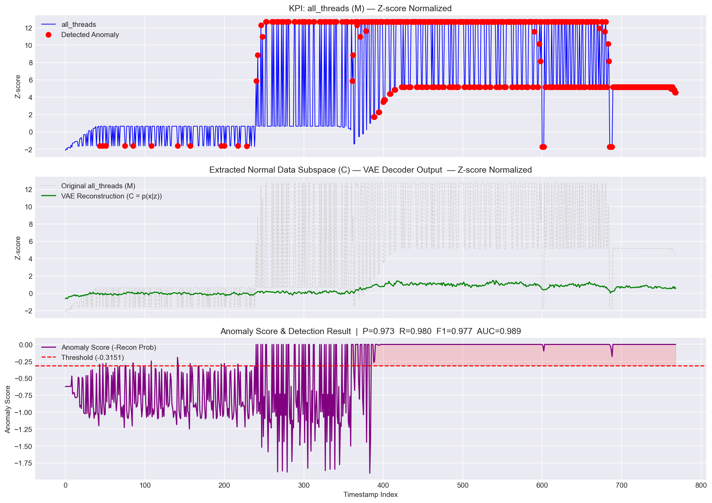

# 软件测试与维护课程大作业

南开大学软件学院 2025-2026 学年第二学期

本项目基于 [Google Cloud Platform 的 Online Boutique](https://github.com/GoogleCloudPlatform/microservices-demo) 微服务演示应用，完成了系统部署、Selenium/JMeter 测试、Prometheus + Grafana 监控、ChaosMesh 故障注入，以及基于深度学习的异常检测实验（USAD 与 Donut）。

---

## 第三方源码说明

`microservices-demo-0.10.5/` 目录来源于 GoogleCloudPlatform/microservices-demo 项目（Apache License 2.0），原始版权归原作者所有。本组新增的部署配置、测试脚本、监控清单、异常检测代码、实验数据和分析结果均为课程作业材料。

---

## 项目结构

```
├── microservices-demo-0.10.5/       # 上游微服务源码（11 个服务 + gRPC proto 定义）
├── manifests-monitoring/            # Prometheus + Grafana Kubernetes 部署清单
├── src/anomaly-detection/           # 异常检测模块
│   ├── visualize.py                 # 训练 + 可视化主入口（自包含流水线）
│   ├── models.py                    # USAD 与 Donut 的 PyTorch 模型实现
│   ├── data_utils.py                # 滑动窗口、归一化、PyTorch Dataset 工具
│   ├── feature_selection.py         # 基于效应量与 KS 检验的特征选择
│   ├── run.py                       # 训练与评估脚本，支持独立运行单个模型
│   └── metrics_collector.py         # Prometheus 数据采集 + ChaosMesh 故障注入
├── data/
│   ├── prometheus_data/             # 从 Prometheus 采集的监控数据
│   │   └── 20260614_133243/         # 实验数据集：368 条，32 维 CPU/内存指标
│   └── jmeter_generated/            # JMeter 性能测试数据（11 个场景合并，769 条）
├── output/                          # Prometheus 数据实验结果（图表 + 指标）
├── output_jmeter/                   # JMeter 数据实验结果（图表 + 指标）
└── tests/                           # Selenium + JMeter 测试用例
```

---

## 异常检测实验

### 基本思路

USAD 和 Donut 均采用基于重建的异常检测范式：模型仅在正常数据上训练，学习正常模式的压缩表示。检测时，正常数据能够被准确重建，重建误差较小；异常数据的模式偏离训练分布，重建误差显著增大，据此判定异常。

### USAD —— 多变量对抗自编码器

USAD（UnSupervised Anomaly Detection，KDD 2020）通过两个自编码器的对抗训练实现异常检测：

```
输入 x（多特征窗口）→ 编码器 E → 潜在表示 z
                              ├→ 解码器 D₁(z) → 重建 w₁
                              └→ 解码器 D₂(E(w₁)) → 对抗重建 w₂

异常得分 = α·||x - w₁||² + β·||w₁ - w₂||²
```

- 输入为多个特征的滑动窗口拼接，模型学习特征间的关联关系
- 训练分两阶段交替进行：D₁ 学习重建输入，D₂ 学习区分正常与异常重建
- 正常时段：两个解码器均能良好重建，得分较低
- 异常时段：D₁ 重建偏差增大，D₂ 进一步放大差异，得分升高

### Donut —— 单变量变分自编码器

Donut（WWW 2018）基于变分自编码器（VAE），每个 KPI 指标独立建模：

```
输入 x（单特征窗口）→ 编码器 → (μz, σz) → 重参数化采样 z
                                       → 解码器 → (μx, σx)

异常得分 = -E[log p(x|z)]（负重建概率，越大越可能异常）
```

- 每个指标训练一个独立的 VAE，不跨特征交互
- 采用 M-ELBO 损失函数，训练时注入缺失数据以增强鲁棒性
- VAE 学习正常数据的概率分布，异常数据落在分布的低概率区域，得分偏高

### 两种方法的对比

| | USAD | Donut |
|------|------|------|
| 输入维度 | 多变量（N 个特征 × 窗口长度） | 单变量（1 个特征 × 窗口长度） |
| 模型数量 | 1 个共享模型 | 每个特征独立训练一个模型 |
| 跨特征关联 | 能够捕捉 | 不涉及 |
| 适用场景 | 多指标联动异常的复杂系统 | 单指标曲线异常即可判定的场景 |

### 特征选择

并非所有监控指标都对故障敏感。部分指标在正常与异常时段变化幅度极小，直接使用会引入噪声。本实验采用两项统计量对特征进行筛选：

- **效应量（Effect Size）**：`|μ_anomaly - μ_normal| / σ_pooled`。衡量故障前后均值的偏移程度，值越大表示该指标对故障的响应越显著。
- **KS 检验（Kolmogorov-Smirnov Test）**：检验正常与异常时段的数据是否来自同一分布。统计量越大，分布差异越显著，特征的区分能力越强。

同时过滤以下类型特征：正常时段方差为零的常量特征；与其他特征高度相关（Pearson r > 0.95）的冗余特征。

---

## 运行命令

### 1. 数据采集（Prometheus + ChaosMesh）

采集新数据前需确保 Kubernetes 集群已部署 Prometheus 和 ChaosMesh。

```bash
python src/anomaly-detection/metrics_collector.py \
  --baseline 1200 \
  --fault 120 \
  --recovery 10 \
  --rounds 30 \
  --interval 15 \
  --output data/prometheus_data
```

| 参数 | 含义 | 本次实验取值 |
|------|------|-------------|
| `--baseline` | 故障注入前正常状态采集时长（秒） | 1200（20 分钟） |
| `--fault` | 单轮故障持续时长（秒） | 120（2 分钟） |
| `--recovery` | 每轮故障后的恢复等待时间（秒） | 10 |
| `--rounds` | 故障注入轮次 | 30 |
| `--interval` | Prometheus 查询间隔（秒） | 15 |

### 2. 特征选择

```bash
# Prometheus 数据
python src/anomaly-detection/feature_selection.py \
  --data data/prometheus_data/20260614_133243/metrics.csv \
  --top 10 \
  --output data/prometheus_data/20260614_133243

# JMeter 数据
python src/anomaly-detection/feature_selection.py \
  --data data/jmeter_generated/metrics_merged.csv \
  --top 10 \
  --output data/jmeter_generated
```

### 3. 模型训练与评估

```bash
# USAD + Donut 联合训练（在 Prometheus 数据上）
python src/anomaly-detection/run.py \
  --model both \
  --data data/prometheus_data/20260614_133243/metrics.csv \
  --window 8 --epochs 100 --threshold 95 \
  --output ./output

# 单独跑 USAD
python src/anomaly-detection/run.py \
  --model usad \
  --data data/prometheus_data/20260614_133243/metrics.csv \
  --window 8 --epochs 100 --threshold 95

# 单独跑 Donut
python src/anomaly-detection/run.py \
  --model donut \
  --data data/prometheus_data/20260614_133243/metrics.csv \
  --window 8 --epochs 100 --threshold 95
```

### 4. 可视化

```bash
# Prometheus 数据
python src/anomaly-detection/visualize.py \
  --data data/prometheus_data/20260614_133243/metrics.csv \
  --window 8 --epochs 100 --donut-features 5 \
  --output ./output

# JMeter 数据
python src/anomaly-detection/visualize.py \
  --data data/jmeter_generated/metrics_merged.csv \
  --window 8 --epochs 100 --donut-features 5 \
  --output ./output_jmeter
```

> `visualize.py` 内部已集成特征选择、训练和出图全流程，可直接使用。如需单独训练或调参，使用上方的 `run.py`。

---

## 实验结果

### Prometheus 监控数据（368 条：240 正常 + 128 异常，32 维 CPU/内存指标）



USAD 联合 Top-10 特征的 AUC 为 0.953。



Donut 在 `cpu_frontend` 上取得最佳单特征 F1（0.924）。

| 模型 | 特征 | Precision | Recall | F1 | AUC |
|------|------|-----------|--------|-----|-----|
| **USAD** | Top-10 多变量 | 0.899 | 0.836 | 0.866 | 0.953 |
| Donut | cpu_frontend | 0.903 | 0.945 | **0.924** | 0.919 |
| Donut | mem_loadgenerator | 0.918 | 0.789 | 0.849 | **0.968** |
| Donut | mem_cartservice | 0.837 | 0.805 | 0.821 | 0.837 |

Prometheus 指标的变化相对微妙（CPU 和内存的波动幅度有限），USAD 通过多变量联合分析获得更稳健的检测效果。Donut 在区分度高的单特征上表现突出，但对区分度不足的特征效果有限。

### JMeter 性能测试数据（769 条：322 正常 + 447 异常，13 维延迟/吞吐指标）





Donut 在 `all_threads` 上 F1 达到 0.977，AUC 达到 0.989。

| 模型 | 特征 | Precision | Recall | F1 | AUC |
|------|------|-----------|--------|-----|-----|
| USAD | Top-10 多变量 | 0.836 | 1.000 | 0.910 | 0.929 |
| Donut | all_threads | 0.973 | 0.980 | **0.977** | **0.989** |
| Donut | avg_threads | 0.973 | 0.978 | 0.975 | 0.987 |
| Donut | median_latency_ms | 0.954 | 0.984 | 0.969 | 0.985 |
| Donut | throughput_req_per_sec | 0.970 | 0.931 | 0.950 | 0.961 |
| Donut | avg_latency_ms | 0.964 | 0.846 | 0.901 | 0.971 |

JMeter 数据的检测效果整体优于 Prometheus，因为线程数、吞吐量等指标与系统负载存在直接的因果关系，正常/异常的分布差异显著。

### 图表阅读说明

每张结果图包含上下三个面板，共享时间轴：

1. **Panel 1 — 原始指标**：z-score 标准化后的监控指标曲线，红色散点标注模型判定的异常时刻。
2. **Panel 2 — 重建对比**：灰色虚线为原始数据，绿色实线为模型重建结果。正常时段两条曲线高度吻合，异常时段绿色曲线无法跟踪灰色虚线的变化——这直接体现了重建型异常检测的核心机制。
3. **Panel 3 — 异常得分**：紫色曲线为异常得分，红色虚线为判定阈值。得分超过阈值即标记为异常。USAD 的得分跨多个数量级，采用对数坐标轴；Donut 得分范围较窄，采用线性坐标轴。

USAD 为多变量模型，仅生成一组三面板图；Donut 按 `--donut-features` 参数对每个特征独立生成一组。

---

## 核心文件说明

| 文件 | 功能 |
|------|------|
| `visualize.py` | 主要入口脚本，集成特征选择 → 训练 → 可视化全流程 |
| `models.py` | USAD（双自编码器对抗）与 Donut（VAE）的 PyTorch 实现 |
| `data_utils.py` | 滑动窗口构建、MinMax/Z-Score 归一化、PyTorch Dataset 封装 |
| `feature_selection.py` | 效应量 + KS 检验的特征排序，输出 `selected_features.json` |
| `run.py` | 训练与评估脚本，支持 `--model both/usad/donut` 切换模式 |
| `metrics_collector.py` | Prometheus 指标采集，内置 5 类 ChaosMesh 故障注入 |
