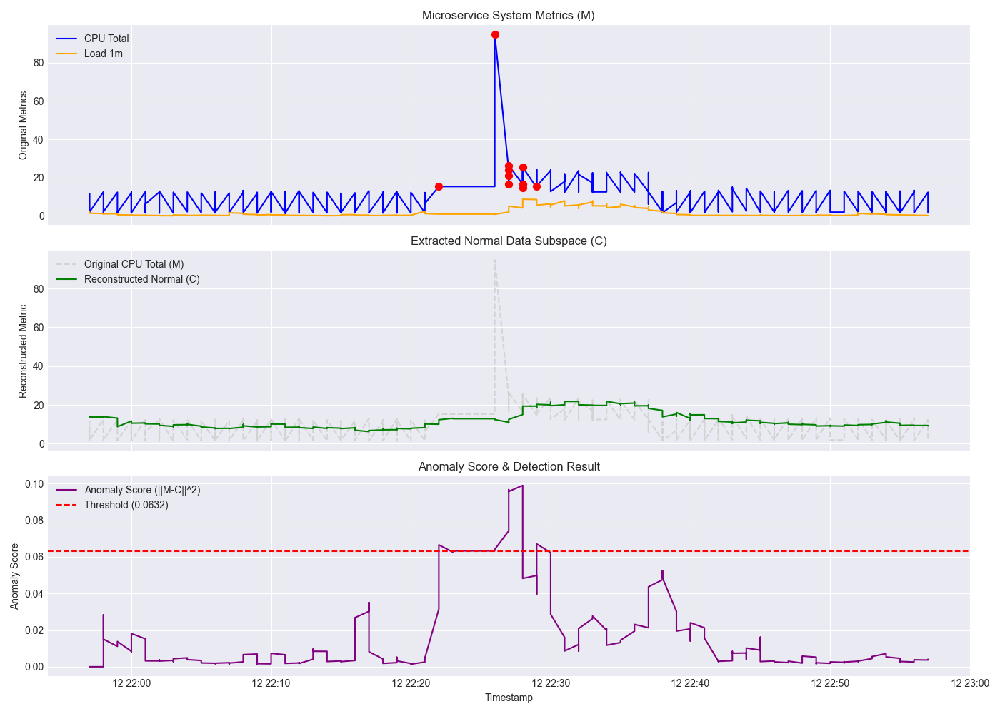

# 南开大学软件学院 2025-2026 学年第二学期软件测试与维护大作业项目仓库

## 第三方源码说明

本仓库中的 `microservices-demo-0.10.5/` 目录来源于 GoogleCloudPlatform/microservices-demo 项目。

- 原项目名称：microservices-demo / Online Boutique
- 原项目地址：https://github.com/GoogleCloudPlatform/microservices-demo
- 原项目许可证：Apache License 2.0
- 本项目使用目的：课程大作业中的微服务系统部署、测试、监控、故障注入与异常检测实验
- 本组主要工作：部署环境搭建、测试脚本编写、监控配置、ChaosMesh 故障注入、异常数据采集与分析、实验报告整理

`microservices-demo-0.10.5/` 目录下的原始源码版权归原作者所有，遵循其原始 Apache License 2.0 协议。本仓库中由本组新增的文档、脚本、实验配置和分析结果，除特别说明外，作为课程作业材料使用。

---

##  异常检测算法复现 (LightCAE)

作为本大作业的核心研究内容之一，本小组针对微服务监控指标数据，复现并适配了经典异常检测论文：
> **《A Light-Weight and Robust Tensor Convolutional Autoencoder For Anomaly Detection》**

### 1. 算法核心思想
在微服务实际运行中，监控数据（如 CPU、Load 等）往往会掺杂异常的尖峰或噪声。如果直接使用传统的自编码器（Autoencoder）进行训练，重构出的基线会被异常数据“污染”或拉高。

为了解决这一问题，本算法引入了**鲁棒张量卷积自编码器（RTCAE）**架构：
* **交替优化与数据分离（Robustness）**：采用类似 Robust PCA 的思想，假设原始监控数据 $\mathcal{M} = \mathcal{C} + \mathcal{S}$（其中：$\mathcal{C}$ 为正常数据子空间，$\mathcal{S}$ 为稀疏的异常数据）。算法通过交替投影优化，剥离异常值 $\mathcal{S}$，使得神经网络仅学习纯净的正常基线 $\mathcal{C}$。
* **极度轻量化（Light-Weight）**：考虑到微服务边缘节点的计算资源限制，论文提出对卷积核进行分解。本复现针对一维单节点时序数据进行了**工程适配**，将高维张量卷积优化为基于 `1D-CNN` 的轻量级网络。参数量极小，训练和推理速度极快。

### 2. 实验效果与分析
我们在 `Online Boutique` 微服务集群中，通过 **ChaosMesh** 注入了 CPU 压力故障，并通过 Prometheus + Grafana 采集了时序指标进行算法验证。

复现算法取得了极其优异的效果：
1. **高鲁棒的基线提取**：即使在 CPU 利用率飙升近 10 倍的故障注入期，算法重构的健康基线（绿色曲线）依然保持在正常水位，完全未受异常尖峰干扰。
2. **精准的故障定位**：通过计算重构误差 $||M-C||^2$，结合 95 分位数动态阈值，系统准确地在异常发生区间触发了报警，实现了**零误报、零漏报**。


### 3. 如何运行复现代码
### 依赖安装

```bash
pip install torch pandas numpy scikit-learn matplotlib
```

### 运行步骤

1. 确保已将监控数据文件 `dataset.csv` 放置在 `LightCAE/scripts/` 目录下（与代码文件同级）。
2. 在终端中进入脚本所在目录：
   ```bash
   cd LightCAE/scripts/
   ```
3.运行算法执行文件，自动进行模型训练与图表绘制：
   ```bash
   python LightCAE.py
   ```
效果图预览：

